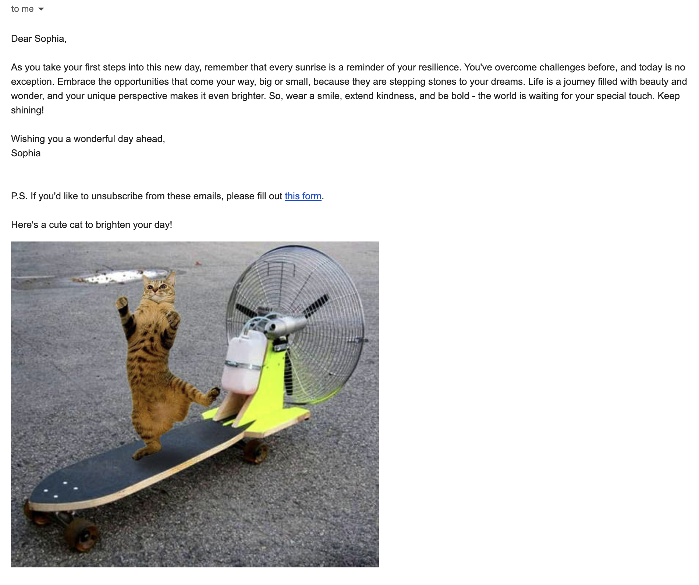

# Daily Positive Thoughts Daily Emails

I created this project because I wanted to receive personalized encouraging messages every day. Sometimes we all need a little positivity in our inbox! The system uses AI to generate uplifting messages.



## Want to Join Me?

If you'd also like to receive daily positive thoughts:
- Fill out this form: [Daily Positive Thoughts Signup](https://forms.gle/SzCf7zVF5KtvndNh6)
- Get daily personalized messages

**Note:** This is my fun side project - I'll keep it running as long as I can, but no guarantees! You can unsubscribe anytime by replying "UNSUBSCRIBE" to any email.

## How It Works

1. You tell me what's been on your mind through the Google Form
2. The system uses Mistral AI to craft a personalized encouraging message
3. You get a daily email with positive thoughts
4. Unsubscribe anytime if you no longer want the messages

## Run It Yourself

Want to set up your own version? Here's how:

1. Install required packages:

```bash
pip install mistralai gspread google-auth python-dotenv
```

2. Set up credentials in `.env` file:
- Gmail account and app password
- Mistral AI API key
- Google service account JSON

3. Run the script:

```bash
python sheets.py
```

## Technical Components

- `sheets.py`: Main script for managing recipients and sending emails
- `send_email.py`: Email sending functionality

Feel free to fork and customize it for your own use! 💌


    